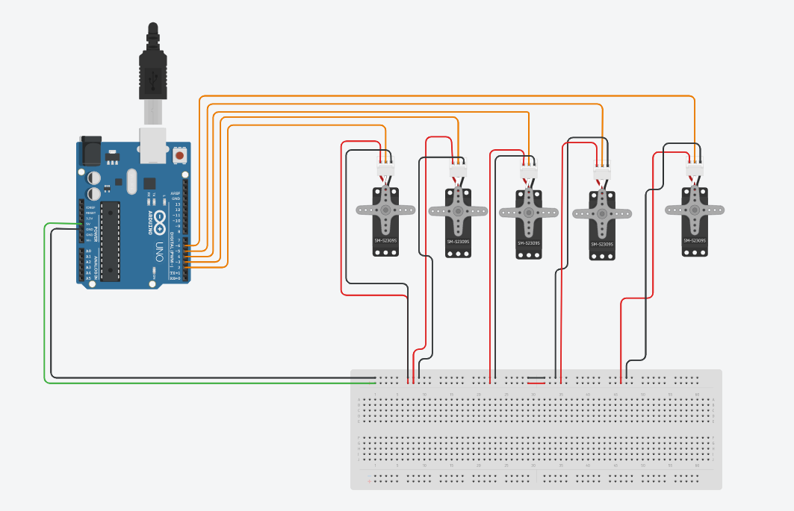

# Arduino-circuit-5motors

This repo contains a task to design and program a circuit with 5 motor for robot arm during internship at smart method company. 
## Steps 
* create an account on [Tinkercad](https://www.tinkercad.com) and design the circuit as shown in the picture. 

* program the arduino to Set the motors degree to 90 by using c++ language. ([see the code](https://github.com/MonaAl-Dawsari/Arduino-circuit-5motors/blob/main/circuit.ino))

* Start Simulation. 

